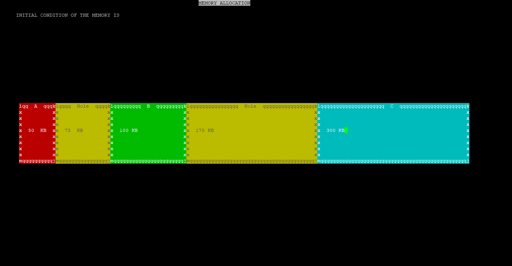
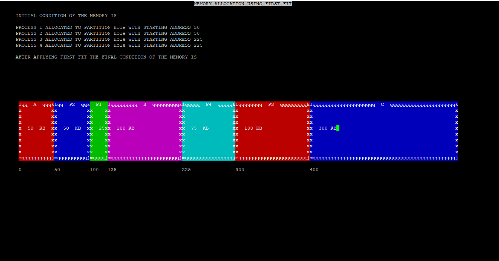
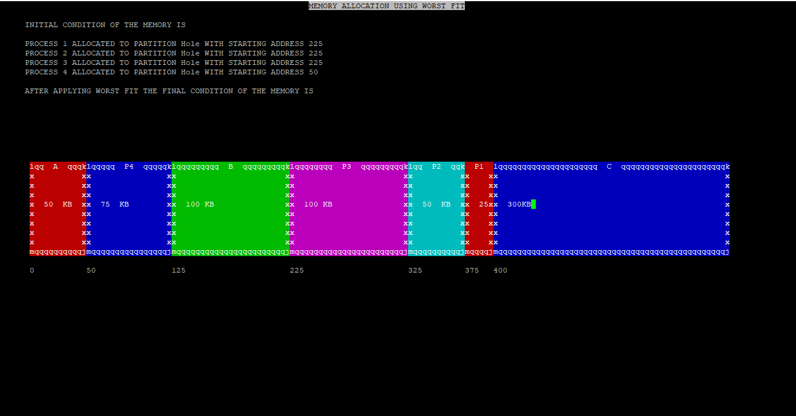

# Memory Allocation Algorithms
GUI Application to demonstrate memory allocation using First Fit, Best Fit and Worst Fit algorithms, built using ncurses.

## Initial Condition of Memory:

## First Fit:

Allocate the process in a free partition(Hole) , which is first sufficient partition from the top of the memory.

## Best Fit:

Allocate the process in a free partition(Hole) , which is the smallest sufficient among the available free partitions.

## Worst Fit:

Allocate the process in a free partition(Hole) , which is the largest sufficient among the available free partitions.

