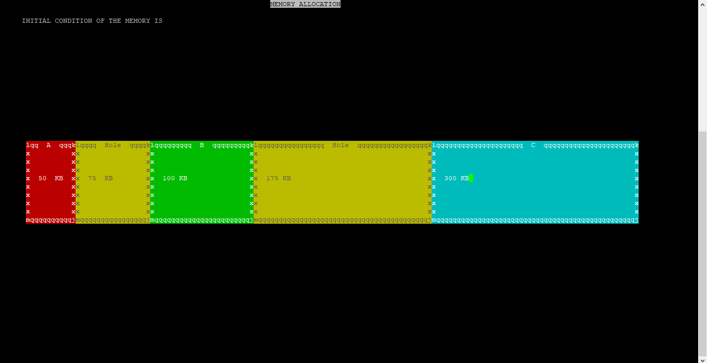
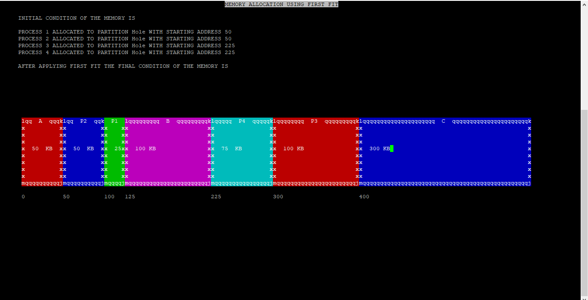
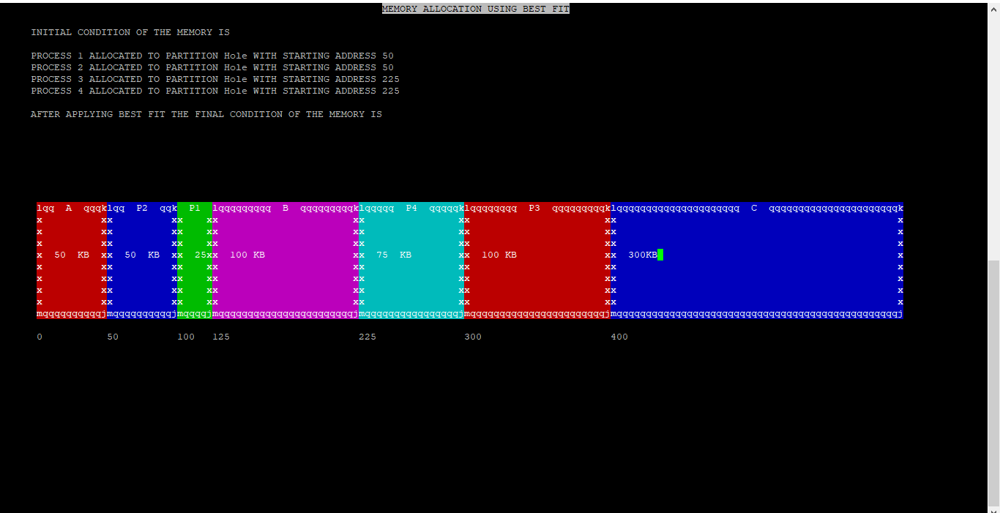
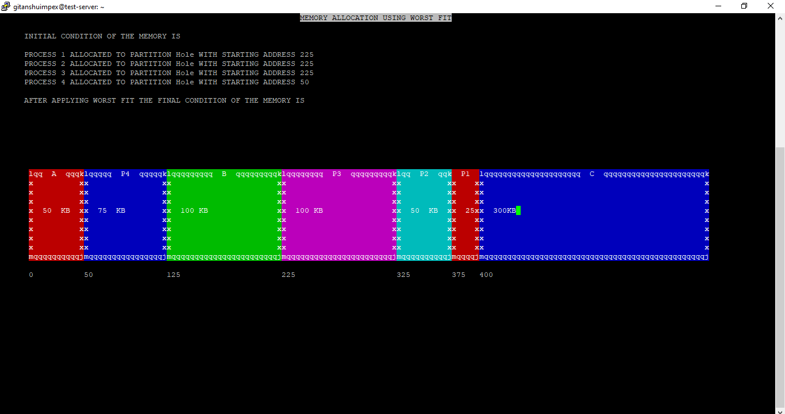

# Memory Allocation Algorithms
GUI Application to demonstrate Memory Allocation using First-fit, Best-fit and Worst-fit algorithms, built using ncurses.

## Initial Condition of the Memory:

## First-fit:

Allocate the process in a free partition(Hole) which is first sufficient partition from the top of the memory.

## Best-fit:

Allocate the process in a free partition(Hole), which is the smallest sufficient among the available free partitions.

## Worst-fit:

Allocate the process in a free partition(Hole), which is the largest sufficient among the available free partitions.

